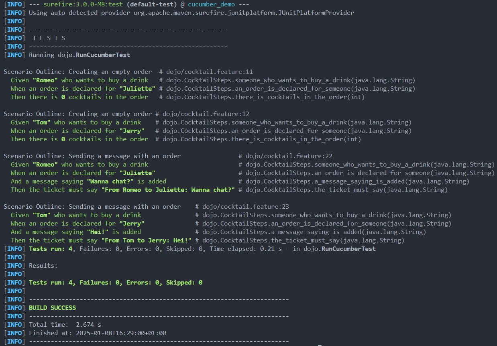
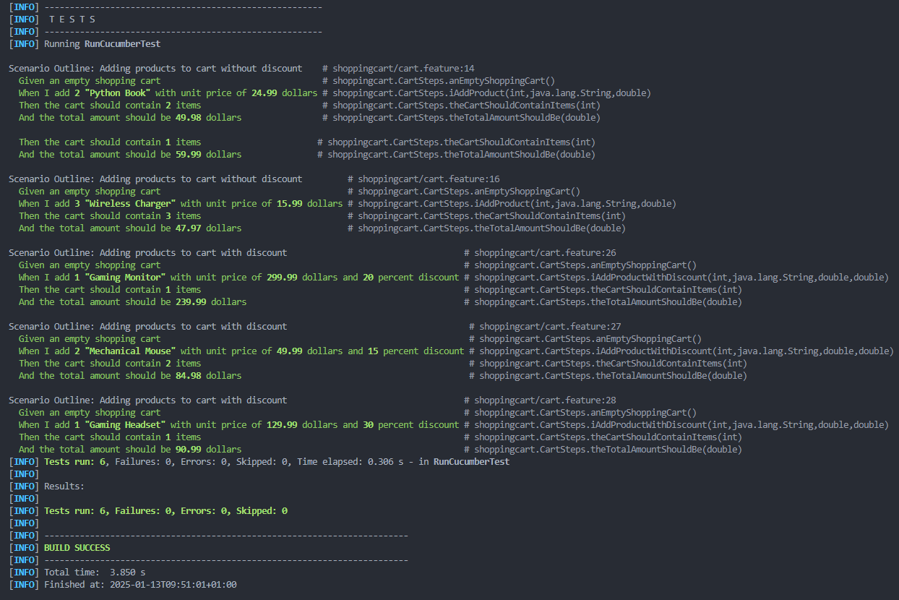
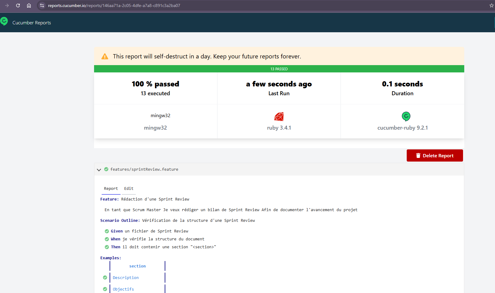
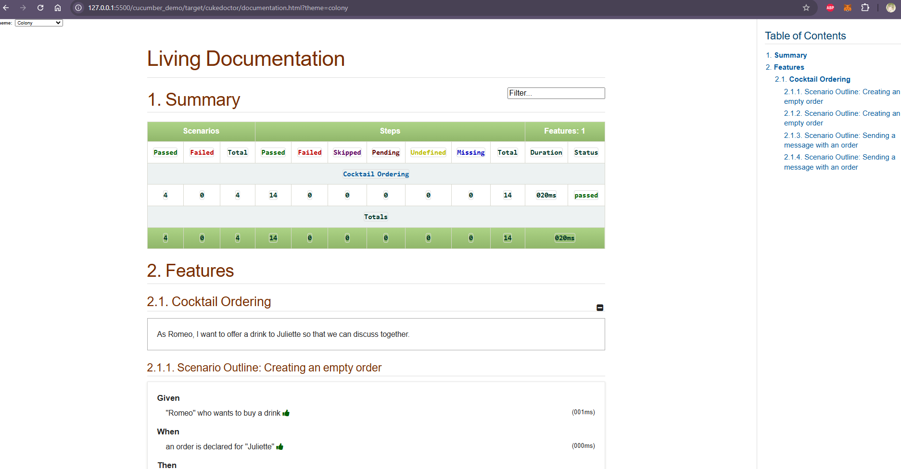
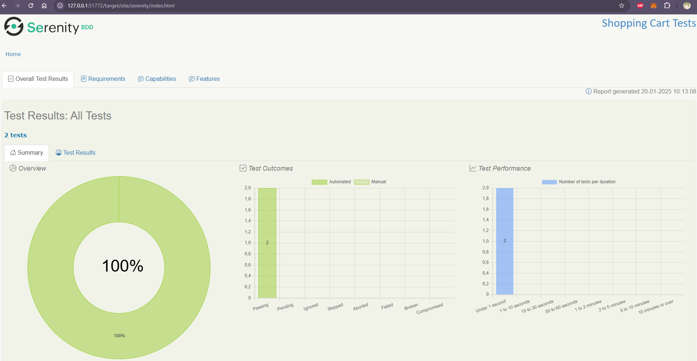
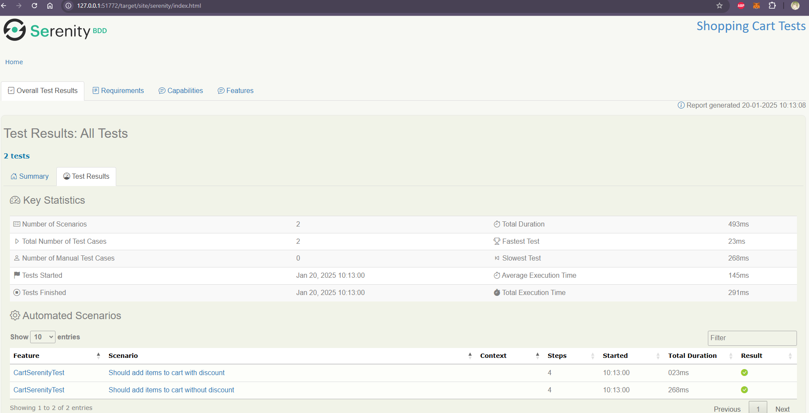
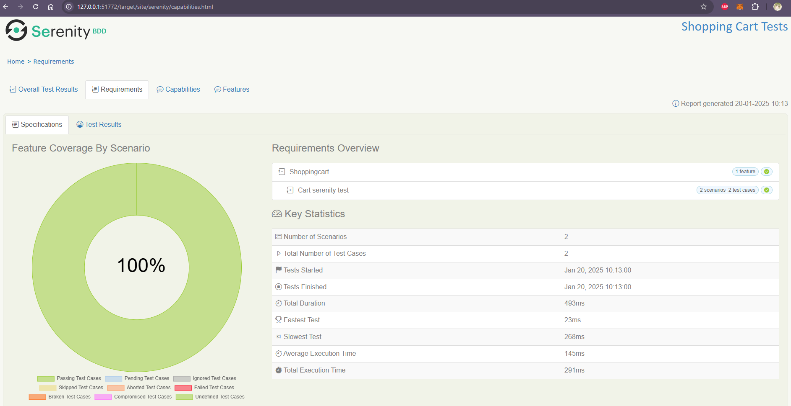
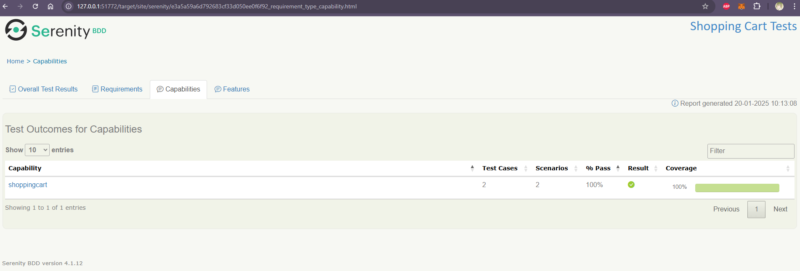
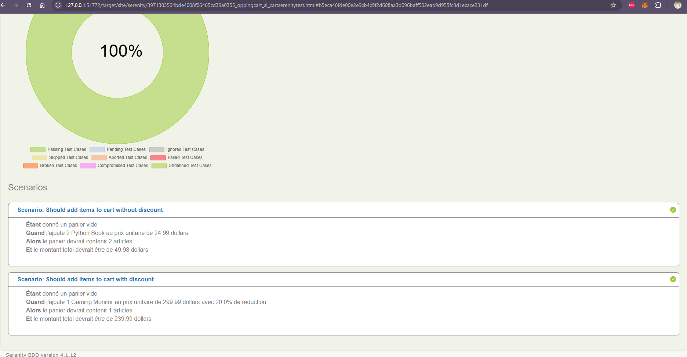

= R5.A.08 -- Dépôt pour les TPs
:icons: font
:MoSCoW: https://fr.wikipedia.org/wiki/M%C3%A9thode_MoSCoW[MoSCoW]

Ce dépôt concerne les rendus de https://github.com/Iamkylian[Kylian GACHET].

== TP1

.Contenu du fichier ```is_it_friday_yet.feature```
[source,text]
----
Feature: Is it Friday yet?
  Everybody wants to know when it's Friday

  Scenario Outline: Checking if it's Friday
    Given today is "<day>"
    When I ask whether it's Friday yet
    Then I should be told "<answer>"

    Examples:
      | day            | answer |
      | Friday         | TGIF   |
      | Sunday         | Nope   |
      | anything else! | Nope   |
----

Le fichier ```is_it_friday_yet.feature``` est le fichier qui permet de définir les tests du TP1.

.Trace d'éxécution des tests du TP1 - Réussis
image::ResultTestTP1.png[Trace d'éxécution du test du TP1]


== TP2

.Contenu du fichier ```Order.java```
[source,java]
----
package dojo;

import java.util.ArrayList;
import java.util.List;

public class Order {

    private String owner;
    private String target;
    private List<String> cocktails;
    private String message;

    public Order() {
        this.cocktails = new ArrayList<>();
    }

    public void declareOwner(String owner) {
        this.owner = owner;
    }

    public void declareTarget(String target) {
        this.target = target;
    }

    public List<String> getCocktails() {
        return cocktails;
    }

    public void setMessage(String message) {
        this.message = message;
    }

    public String getTicket() {
        return String.format("From %s to %s: %s", owner, target, message);
    }
}
----

Le fichier ```Order.java``` est le fichier qui permet de définir la classe ```Order``` qui permet de définir les commandes.

.Trace d'éxécution des tests du TP2 - Réussis



== TP3

.Contenu du fichier ```cart.feature```
[source,text]
----
Feature: Shopping Cart Management
  As a customer
  I want to manage my shopping cart
  So that I can prepare my order

  Scenario Outline: Adding products to cart without discount
    Given an empty shopping cart
    When I add <quantity> "<product>" with unit price of <price> dollars
    Then the cart should contain <quantity> items
    And the total amount should be <total> dollars

    Examples:
      | product           | quantity | price  | total |
      | Python Book      | 2        | 24.99  | 49.98 |
      | USB Webcam       | 1        | 59.99  | 59.99 |
      | Wireless Charger | 3        | 15.99  | 47.97 |

  Scenario Outline: Adding products to cart with discount
    Given an empty shopping cart
    When I add <quantity> "<product>" with unit price of <price> dollars and <discount> percent discount
    Then the cart should contain <quantity> items
    And the total amount should be <total> dollars

    Examples:
      | product           | quantity | price  | discount | total  |
      | Gaming Monitor   | 1        | 299.99 | 20      | 239.99 |
      | Mechanical Mouse | 2        | 49.99  | 15      | 84.98  |
      | Gaming Headset   | 1        | 129.99 | 30      | 90.99  | 
----

Le fichier ```cart.feature``` est le fichier qui permet de définir les tests du TP3.

.Contenu du fichier ```Cart.java```
[source,java]
----
package shoppingcart;

import java.util.ArrayList;
import java.util.List;

public class Cart {

    private List<Item> items;

    public Cart() {
        this.items = new ArrayList<>();
    }

    public void addItem(String name, int quantity, double price, double discount) {
        Item item = new Item(name, quantity, price, discount);
        items.add(item);
    }

    public int getTotalItems() {
        return items.stream()
                .mapToInt(Item::getQuantity)
                .sum();
    }

    public double getTotalAmount() {
        return items.stream()
                .mapToDouble(item -> item.getFinalPrice() * item.getQuantity())
                .sum();
    }
}

class Item {

    private String name;
    private int quantity;
    private double price;
    private double discount;

    public Item(String name, int quantity, double price, double discount) {
        this.name = name;
        this.quantity = quantity;
        this.price = price;
        this.discount = discount;
    }

    public int getQuantity() {
        return quantity;
    }

    public double getPrice() {
        return price;
    }

    public double getDiscount() {
        return discount;
    }

    public double getFinalPrice() {
        return price * (1 - discount / 100);
    }
}
----

Le fichier ```Cart.java``` est le fichier qui permet de définir la classe ```Cart``` et la classe ```Item``` qui permet de définir les items du panier.

.Contenu du fichier ```CartSteps.java```
[source,java]
----
package shoppingcart;

import static org.junit.Assert.assertEquals;

import io.cucumber.java.en.Given;
import io.cucumber.java.en.Then;
import io.cucumber.java.en.When;

public class CartSteps {

    private Cart cart;

    @Given("an empty shopping cart")
    public void anEmptyShoppingCart() {
        cart = new Cart();
    }

    @When("I add {int} {string} with unit price of {double} dollars")
    public void iAddProduct(int quantity, String product, double price) {
        cart.addItem(product, quantity, price, 0);
    }

    @When("I add {int} {string} with unit price of {double} dollars and {double} percent discount")
    public void iAddProductWithDiscount(int quantity, String product, double price, double discount) {
        cart.addItem(product, quantity, price, discount);
    }

    @Then("the cart should contain {int} items")
    public void theCartShouldContainItems(int expectedCount) {
        assertEquals(expectedCount, cart.getTotalItems());
    }

    @Then("the total amount should be {double} dollars")
    public void theTotalAmountShouldBe(double expectedAmount) {
        assertEquals(expectedAmount, cart.getTotalAmount(), 0.01);
    }
}
----

Le fichier ```CartSteps.java``` est le fichier qui permet de définir les étapes des tests du TP3.

.Contenu du fichier ```RunCucumberTest.java```
[source,java]
----
package shoppingcart;

import org.junit.platform.suite.api.ConfigurationParameter;
import org.junit.platform.suite.api.IncludeEngines;
import org.junit.platform.suite.api.SelectClasspathResource;
import org.junit.platform.suite.api.Suite;

import static io.cucumber.junit.platform.engine.Constants.PLUGIN_PROPERTY_NAME;

@Suite
@IncludeEngines("cucumber")
@SelectClasspathResource("shoppingcart")
@ConfigurationParameter(key = PLUGIN_PROPERTY_NAME, value = "pretty")
public class RunCucumberTest {
}
----

Le fichier ```RunCucumberTest.java``` est le fichier qui permet d'exécuter les tests du TP3. Les annotations Java avec ```@``` sont des annotations qui permettant notamment d'afficher les détails des tests lors de leur execution.

.Trace d'éxécution des tests du TP3 - Réussis


Le projet implémente un système de panier d'achat avec les fonctionnalités suivantes :

* ```Cart.java``` : Gestion d'un panier d'achats
** Ajout de produits avec ou sans réduction
** Calcul du montant total et du nombre total d'items dans le panier
* ```Item.java``` : Définition des items du panier
** Récupération de la quantité, du prix, du montant de la réduction et du prix final d'un item

Ce projet avait pour objectif de tester les cas d'usages d'un panier d'achat. Notamment l'ajout de produits avec ou sans réduction, avec le calcul du montant total (avec ou sans réduction) et du nombre total d'items dans le panier.

== TP4

=== Documentation minimale (cucumber)

Pour réaliser cette documentation, j'ai utilisé le projet ```hellocucumber```.
Afin de générer la documentation, il faut exécuter la commande suivante :

[source,bash]
----
mvn test | tail -n 16 > report.txt
----

.Contenu du fichier ```report.txt``` généré

include::hellocucumber/report.txt[]

```include::hellocucumber/report.txt[]``` ne fonctionnant pas comme indiqué dans le TP4, J'ajoute le lien du fichier ```report.txt```.

=== Documentation améliorée (cucumber en ligne de commande)

.Rapport en ligne des tests de la SAE 5 - Réussis


=== Documentation améliorée (cukedoctor)

Pour réaliser cette documentation, j'ai utilisé le projet ```cucumber_demo```.
Afin de générer la documentation, il faut exécuter la commande suivante :

[source,bash]
----
mvn cukedoctor:execute
----

.Extrait du rapport généré par le plugin ```cukedoctor``` pour le projet ```cucumber_demo```


=== Véritable rapport (serenity)

Pour réaliser cette documentation, j'ai utilisé le projet ```shoppingcart```.
Afin de générer la documentation, il a fallu cloner le projet https://github.com/serenity-bdd/serenity-junit-screenplay-starter[serenity starter] et le configurer pour le projet ```shoppingcart```.
Ainsi, une fois le projet configuré, il faut exécuter la commande suivante :

[source,bash]
----
mvn clean verify
----

.Extrait du rapport généré par le plugin ```serenity``` pour le projet ```shoppingcart``` - Overall Test Results 1


.Extrait du rapport généré par le plugin ```serenity``` pour le projet ```shoppingcart``` - Overall Test Results 1.5


.Extrait du rapport généré par le plugin ```serenity``` pour le projet ```shoppingcart``` - Requirements


.Extrait du rapport généré par le plugin ```serenity``` pour le projet ```shoppingcart``` - Capabilities


.Extrait du rapport généré par le plugin ```serenity``` pour le projet ```shoppingcart``` - Features

